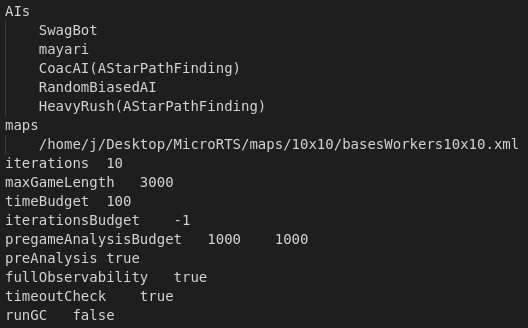
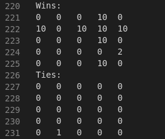

# SwagEpic

Based on Mayari template made by Krerkkiat Chusap and Brady Phelps

Archer-Only. Heavy and Light units are 4 nerdz

### Dependencies
Java
Ant

## Build

```console
./gradlew build
```

Jar file @ `swag-bot/build/libs/swag-bot.jar`

## How to use bot

move bot's jar file into MicroRTS folder

Run micro-rts-tournament

# Bot Evaluation Tournament

The tournament was between

0. swag-bot
0. mayari
0. coac-ai
0. RandomBiasedAI
0. HeavyRush

on the 10x10 map

As it turns out my bot really sucks. I thought the archer-only would be super dope, but that is not the case.

## Tournament Setup


## Tournament Results

